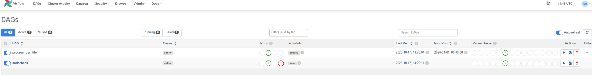
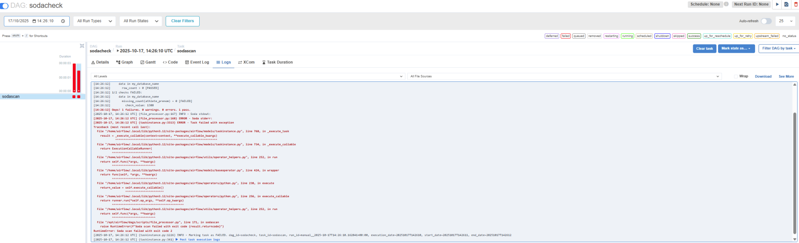
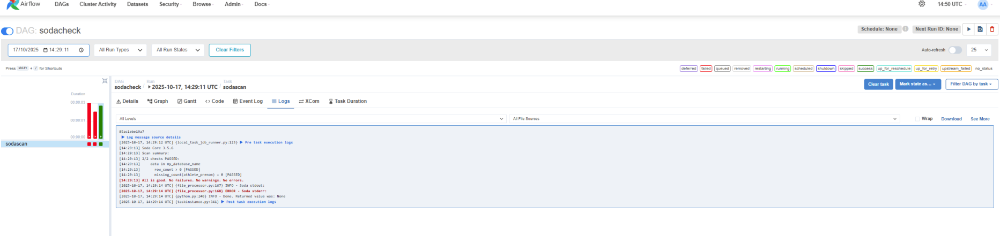

# 📊 Analyse des données des Jeux Olympiques – Projet Dockerisé

## 🎯 Objectif

Ce projet a été développé pour fournir un outil local simple et puissant permettant à un Data Analyst :
- d’exécuter des requêtes SQL sur des données sportives,
- d’afficher les résultats via une interface graphique (Streamlit),
- de simuler l’arrivée de nouvelles données tous les 4 ans grâce à Apache Airflow.

---

## 🗃️ Structure du projet

brief_jo/
├── Dockerfile
├── docker-compose.yml
├── requirements.txt
├── streamlit_app.py
├── airflow/
│ └── dags/
│ └── update_data_dag.py
├── data/
│ └── fact_resultats_epreuves.csv
└── README.md

---

## 🚀 Lancement de l'application

### 1. Prérequis

- Docker Desktop a installé
- Aucune autre installation nécessaire

### 2. Démarrage

Dans le terminal (à la racine du dossier `brief_jo`) :

```bash
docker compose build
docker compose up


3. Interfaces
Streamlit : http://localhost:8501

Airflow : http://localhost:8080

🧪 Contrôles qualité – Intégration de Soda

Le projet utilise Soda Core pour automatiser la vérification de la qualité des données. Cette solution simple permet de détecter rapidement les valeurs manquantes ou anomalies dans les datasets. Ainsi, elle garantit la fiabilité des données tout au long du pipeline.

  
  

